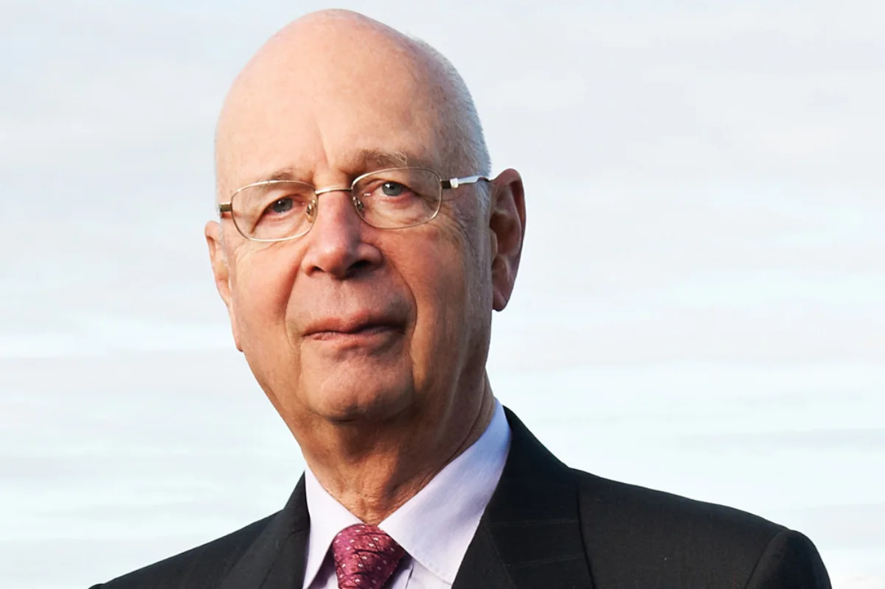
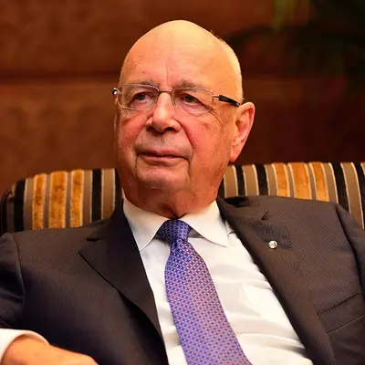
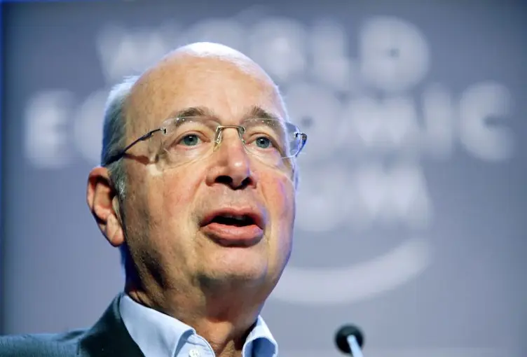
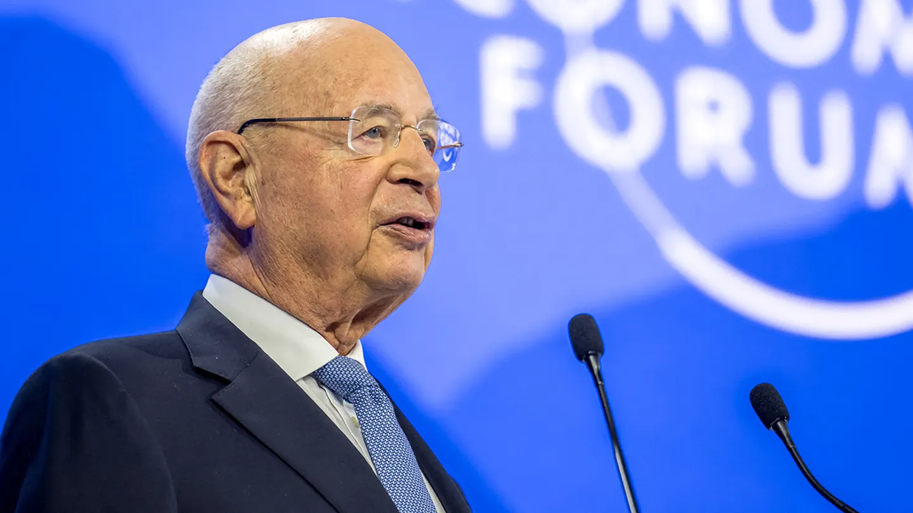

# m3/Klaus Schwab (World Economic Forum)

## 1611259004006-wef.jpeg.avif

## 664cc9864cce1664cc9864cce2.jpg.avif

## 68c178c8f7fcc63e410969c8_klaus20schwab201-scaled-2.jpeg.avif

## 727d9f05-f1b8-4fb1-afbb-25fffda1410b_1269x717.jpg.avif

## FEATURE_Klaus-Schwab.webp

## Founder and President of the World Economic Forum, Klaus Schwab, in Davos, Switzerland, Jan. 27, 2000.webp

## FuLclFgWAB8nF3S.jpg.avif

## Klaus Schwab - World Economic Forum Annual Meeting 1974 (European Management Symposium).jpg.avif

## Klaus Schwab, founder of the World Economic Forum (WEF) on January 15, 2019.webp

## Klaus-Schwab-net-worth.jpg.avif

## Klaus-Schwab.webp

## Klaus_Schwab_-_World_Economic_Forum_Annual_Meeting_Davos_2007.webp

## archiv-14012024-schweiz-davos-klaus-schwab-gruender-des-weltwirtschaftsforums-wef-waehrend-de.jpeg.avif

## klaus-schwab.webp

## klaus_schwab-classroom-WEF.jpg.avif

## klaus_schwab.jpg.avif

## p3-schwab-a-20131115.jpg.avif

