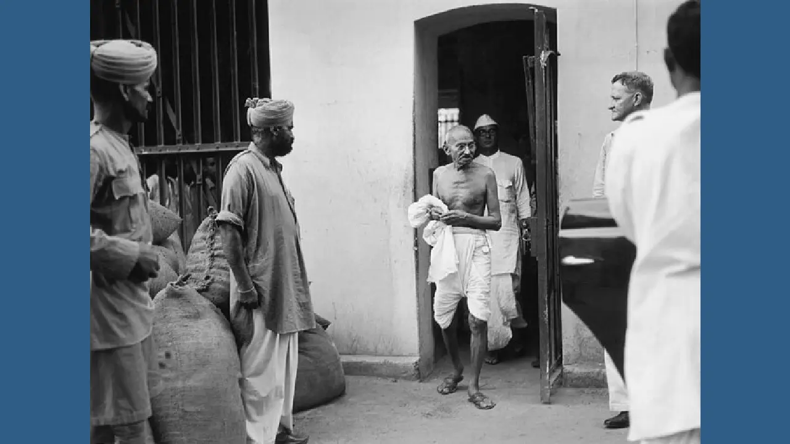
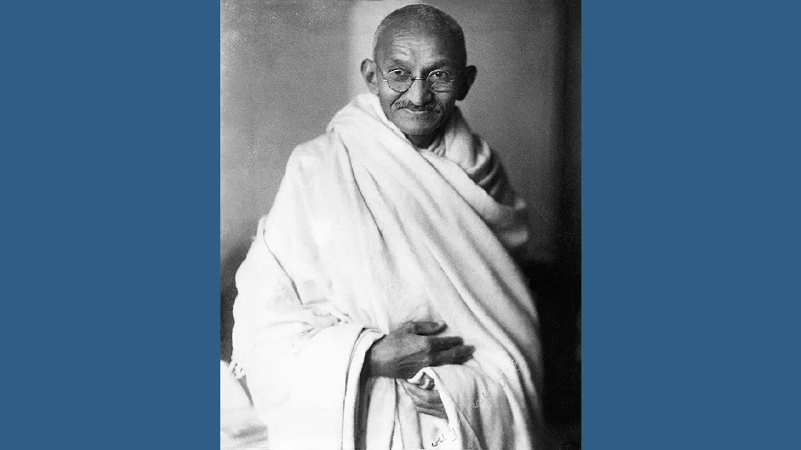

# m4/Mahatma Gandhi

## 1686010667_gandhimk.jpg.avif

## 1751762_orig.jpg.avif

## HD2rhZBXUAAFPHX.jpeg.avif

## Mahatma-Gandhi-2-f.webp

## Mahatma-Gandhi-f.webp

## acba2b97a62c86b52bcbbc8a30c68f24.jpg.avif

## kasturba-gandhi-and-mahatma-gandhi-at-sevagram-ashram-1942-with-ashramite-EXMJ3D.jpg.avif

## mahatma-Gandhi.jpg.avif

## mahatma-gandhi (1).png.avif

## mahatma-gandhi-1869-1948-indian-independence-leader-in-a-third-class-GXWAHC.jpg.avif

## mahatma-gandhi-1869-1948-indian-nationalist-leader-about-1925-DW4Y0Y.jpg.avif

## mahatma-gandhi-C5JY9J.jpg.avif

## mahatma-gandhi-EJDPPW.jpg.avif

## mahatma-gandhi-and-abha-gandhi-at-sevagram-ashram-1945-no-mr-EXMJ95.jpg.avif

## mahatma-gandhi-and-kasturba-gandhi-at-sevagram-ashram-january-1942-EXMJ15.jpg.avif

## mahatma-gandhi-april-1931-2BTPB94.jpg.avif

## mahatma-gandhi-at-birla-house-bombay-mumbai-india-august-1942-EXMMM1.jpg.avif

## mahatma-gandhi-at-right-with-lord-pethick-lawrence-british-secretary-of-state-for-india-in-delhi-on-18-april-1946-2XKCKW3.jpg.avif

## mahatma-gandhi-during-prayer-at-bombay-mumbai-maharashtra-india-asia-september-1944-R70X44.jpg.avif

## mahatma-gandhi-greeting-by-traditional-indian-style-folded-hands-namaste-at-delhi-india-march-1939-old-vintage-1900s-picture-R70TKY.jpg.avif

## mahatma-gandhi-greeting-juhu-beach-bombay-india-may-1944-EXMMBC.jpg.avif

## mahatma-gandhi-hanna-lazar-and-mahatma-gandhis-grandson-kahandas-leaving-EXMJAG.jpg.avif

## mahatma-gandhi-laughing-in-a-train-compartment-india-1939-old-vintage-EXMKH7.jpg.avif

## mahatma-gandhi-sitting-down-folded-legs-looking-through-microscope-and-studying-leprosy-germs-sevagram-ashram-wardha-nagpur-india-1940-2B45K7M.jpg.avif

## mahatma-gandhi-studio-portrait-taken-in-london-england-at-the-request-of-lord-irwin-1931-old-vintage-1900s-picture-R70WGY.jpg.avif

## mahatma-gandhi-with-jawaharlal-nehru-E0KNK7.jpg.avif

## mahatma-gandhi-with-kashibehn-gandhi-holding-her-grandson-sharad-lilavatibehn-EXMJJ6.jpg.avif

## mahatma-gandhi-with-stick-at-sevagram-ashram-wardha-nagpur-maharashtra-EXMJ16.jpg.avif

## mahatma-gandhi.png.avif

