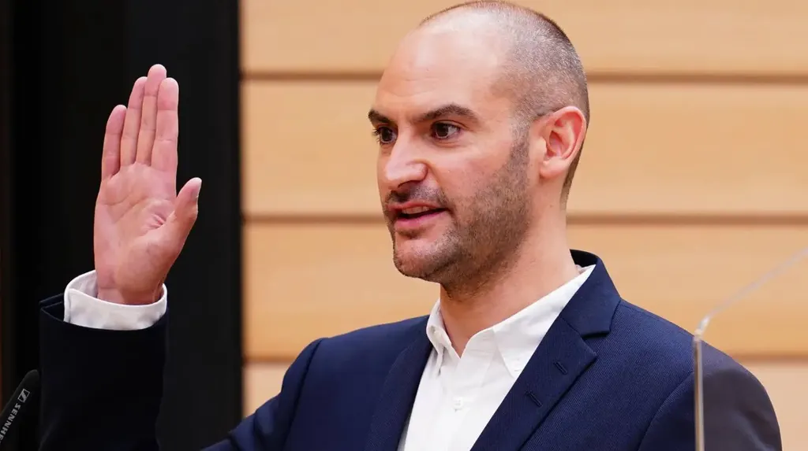
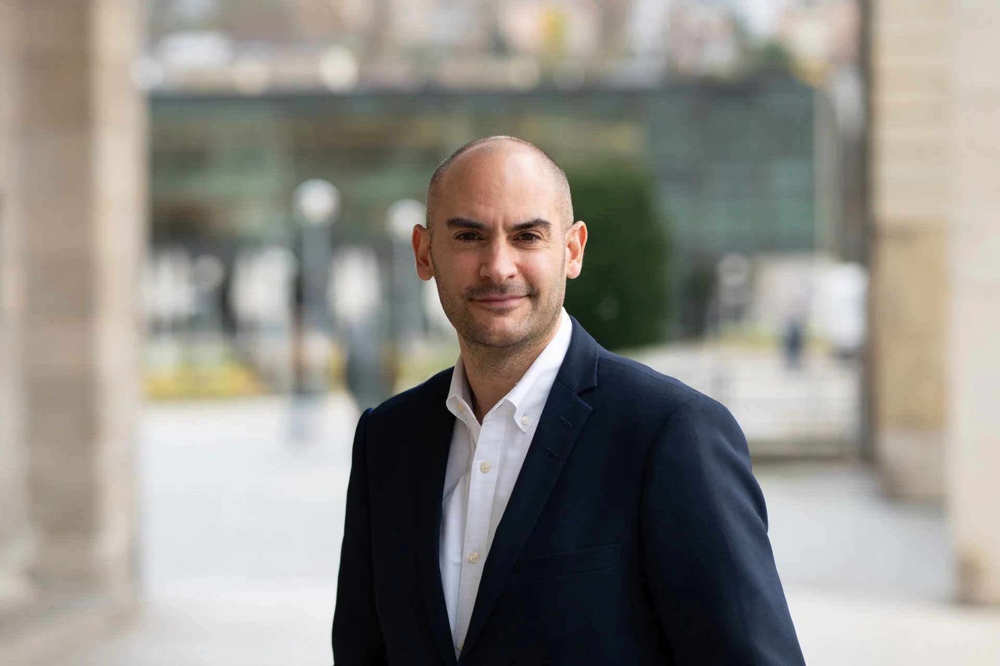
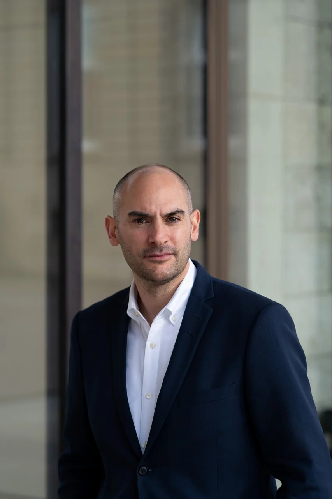
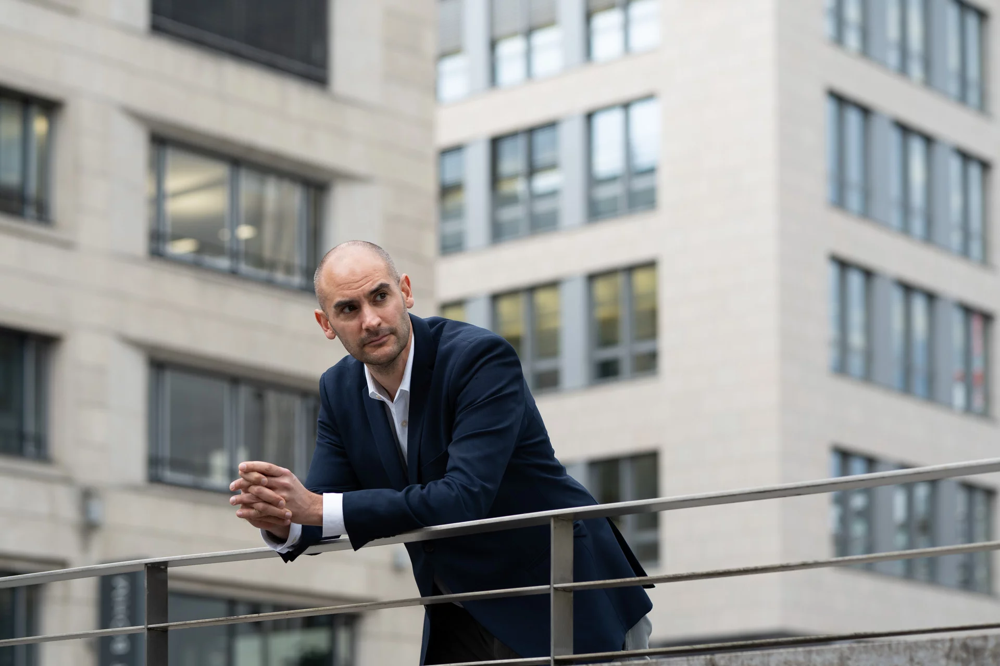
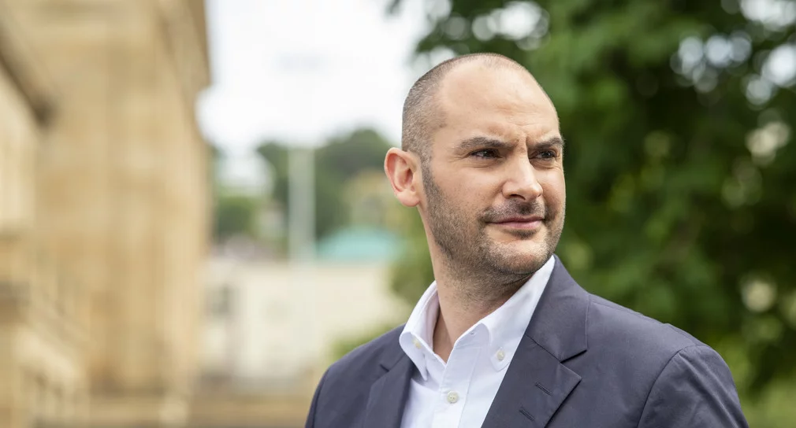
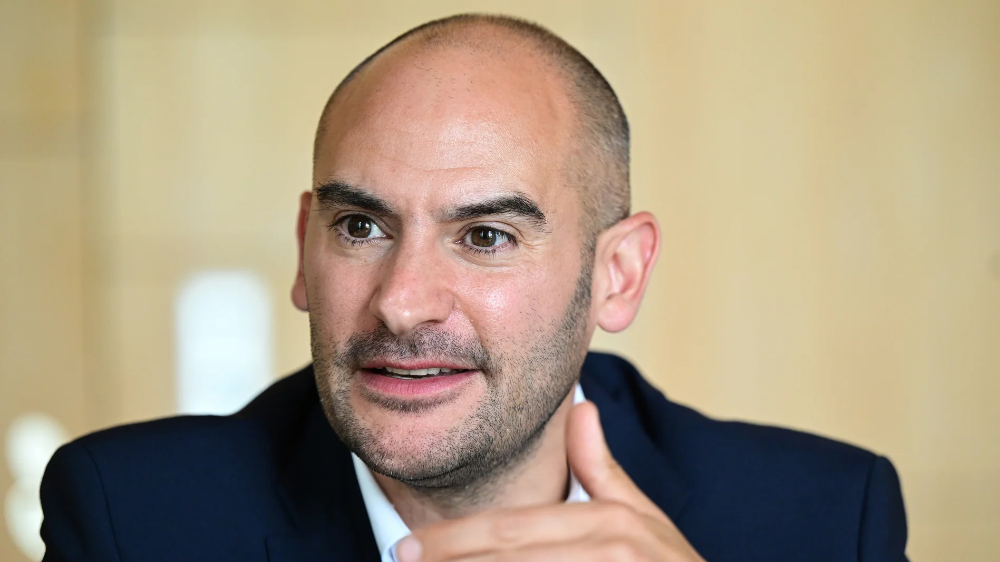
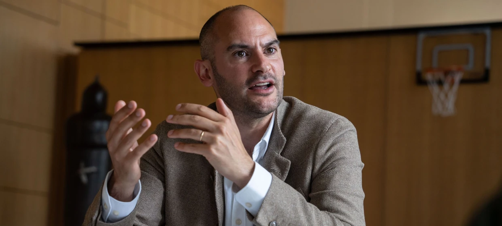

# todo/Danyal Bayaz (Die Grünen)

## 1286528_1_detailbig_637f9f950ea01.jpg.avif

## 1769664_1_teaser1024r056_img_04694259.webp

## 210518_bayaz_03173_voll-1500x1000.jpg.avif

## 257495267.jpeg.avif

## 28026451-der-heidelberger-gruenen-politiker-danyal-bayaz-finanzminister-von-baden-wuerttemberg-bei-einer-plenarsitzung-im-stuttgarter-landtag-archivfoto-Mfe.jpg.avif

## Danyal-Bayaz-taz-FUTURZWEI.jpg.avif

## archiv-danyal-bayaz-die-grunen-finanzminister-von-baden-wurttemberg-nimmt-an-einer-plenarsitzung-des-landtags-von-baden-wurttemberg-teil-foto-marijan-muratdpa.avif

## baden-wurttembergs-finanzminister-danyal-bayaz.avif

## csm_250127_bayaz00242_voll_c193a07e94.webp

## csm_250127_bayaz00309_voll_26dd4e3d7a.webp

## csm_250127_bayaz00513_voll_c94fbed9d9.webp

## csm_250127_bayaz00638_voll_4ff30ed69a (1).webp

## csm_Danyal_Bayaz_RP04110_6f12ddf4e1.webp

## csm_Danyal_Bayaz_b50d4318eb.webp

## csm_Portrait_Danyal_Bayaz_02_c_Mueller_87c704eeff.png.avif

## danyal-bayaz-finanzminister-baden-wuerttemberg-100-1920x1080.jpg.avif

## danyal-bayaz-gruene.webp

## danyal-bayaz-jpg (1).avif

## danyal-bayaz.webp

## media.media.3f166c1b-43a6-42cd-bf52-d278dfc7bc3c.16x9_700.jpg.avif

## media.media.e8bb4b6c-f991-419f-a41f-590412b776ca.16x9_700.jpg.avif

